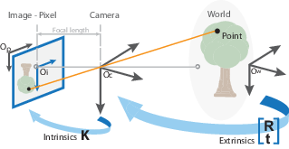
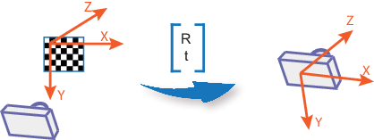
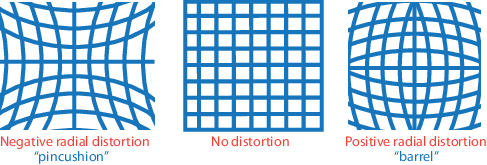

# Camera-Caliberation
### Introduction
Geometric camera calibration, also referred to as camera resectioning, estimates the parameters of a lens and image sensor of an image or video camera. You can use these parameters to correct for lens distortion, measure the size of an object in world units, or determine the location of the camera in the scene. These tasks are used in applications such as machine vision to detect and measure objects. They are also used in robotics, for navigation systems, and 3-D scene reconstruction.

Camera parameters include intrinsics, extrinsics, and distortion coefficients. To estimate the camera parameters, you need to have 3-D world points and their corresponding 2-D image points. You can get these correspondences using multiple images of a calibration pattern, such as a checkerboard. Using the correspondences, you can solve for the camera parameters. After you calibrate a camera, to evaluate the accuracy of the estimated parameters, you can:

- Plot the relative locations of the camera and the calibration pattern

- Calculate the reprojection errors.

- Calculate the parameter estimation errors.

#### Pinhole Camera Model
A pinhole camera is a simple camera without a lens and with a single small aperture. Light rays pass through the aperture and project an inverted image on the opposite side of the camera. Think of the virtual image plane as being in front of the camera and containing the upright image of the scene.

The pinhole camera parameters are represented in a 4-by-3 matrix called the camera matrix. This matrix maps the 3-D world scene into the image plane. The calibration algorithm calculates the camera matrix using the extrinsic and intrinsic parameters. The extrinsic parameters represent the location of the camera in the 3-D scene. The intrinsic parameters represent the optical center and focal length of the camera.

The world points are transformed to camera coordinates using the extrinsics parameters. The camera coordinates are mapped into the image plane using the intrinsics parameters.

#### Camera Calibration Parameters
The calibration algorithm calculates the camera matrix using the extrinsic and intrinsic parameters. The extrinsic parameters represent a rigid transformation from 3-D world coordinate system to the 3-D camera’s coordinate system. The intrinsic parameters represent a projective transformation from the 3-D camera’s coordinates into the 2-D image coordinates.

##### Extrinsic Parameters
The extrinsic parameters consist of a rotation, R, and a translation, t. The origin of the camera’s coordinate system is at its optical center and its x- and y-axis define the image plane.

##### Intrinsic Parameters
The intrinsic parameters include the focal length, the optical center, also known as the principal point, and the skew coefficient. 

#### Distortion in Camera Calibration
The camera matrix does not account for lens distortion because an ideal pinhole camera does not have a lens. To accurately represent a real camera, the camera model includes the radial and tangential lens distortion.

##### Radial Distortion
Radial distortion occurs when light rays bend more near the edges of a lens than they do at its optical center. The smaller the lens, the greater the distortion.

